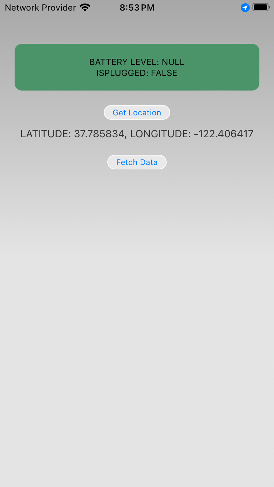

# MS Cordova App Assignment

# Objective:
Setup a demo Cordova app with platform and plugins.

# Platforms
1. iOS
2. Android
3. Web Browser

# Plugins
1. cordova-plugin-whitelist
2. cordova-plugin-battery-status
3. cordova-plugin-geolocation

# Screenshot 1

    

# Screenshot 2

    

# Screenshot 3

    

